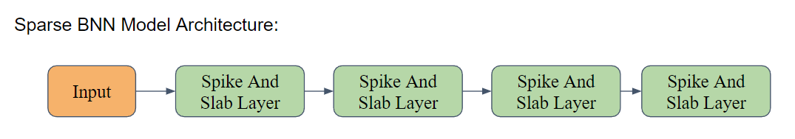
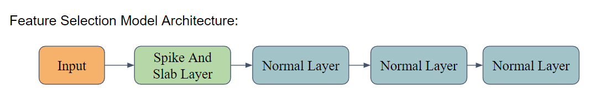
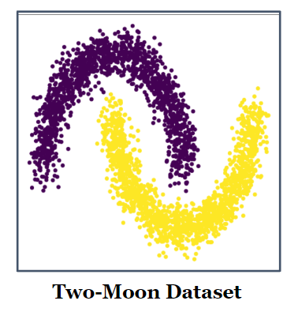
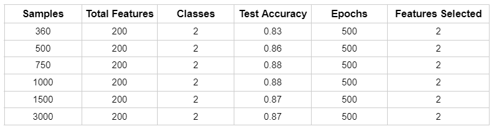
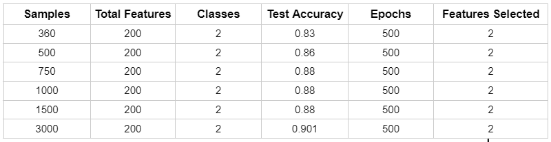
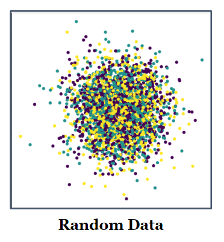
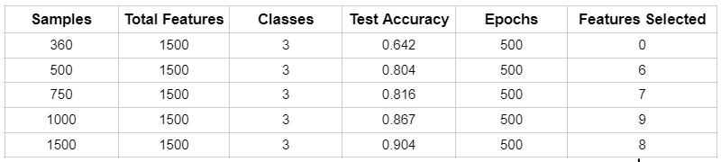
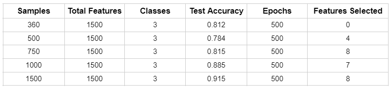
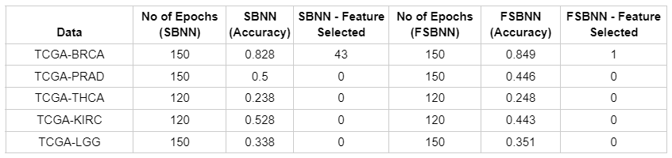
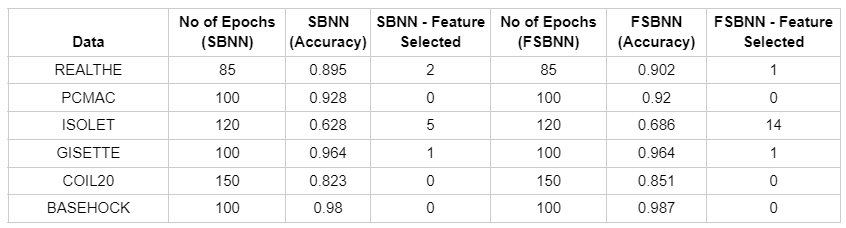

# File Descriptions and Overview

We have made folders for different Real Datasets, 5 for Cancer Data and 6 for STG Data. In each folder, there are two files, namely test_sparse_bnn and test_feature_selection along with the Datasets themselves. Each file on running creates a new folder, in which all the relevant plots are saved and can be used for detailed analysis later. 

There are also two pairs of python files for Synthetic Datasets (Moon and Random) for both Sparse BNN Classification and Feature Selection Classification. Using these, we can run our model for both Moon and Random datasets with the Number of Samples as well as Dimensions of our choice for experimentation.

### Sparse BNN Classification File:

 

 

This file contains the Sparse BNN class, incorporating a set of layers designed to leverage the Sparse Bayesian Neural Network (BNN) methodology used in the [sparse-variational-bnn](https://github.com/JinchengBai/sparse-variational-bnn) paper. The class comprises four spike and slab layers, strategically engineered to facilitate feature selection and extraction. By employing this method, we can effectively identify and utilize essential features from the given dataset.  

The original model was designed for regression, but we modified it significantly for classification by adjusting the loss function and overall architecture, and also ensured that the model aligned perfectly with the dataset characteristics and achieved optimal performance. 
 

### Feature Selection Classification File:

 

 

This file contains the Feature Selection class that we have made, taking motivation from the original Sparse BNN method mentioned above. Our model's goal was to extract important features for predicting the given class. The class comprises one spike and slab layer (Feature Selection Layer) followed by three normal layers, strategically engineered to facilitate feature selection and extraction. Furthermore, this class and the one above allows for fine-tuning of hyperparameters to optimize model performance, enabling customization based on specific datasets and requirements.
 

### Layers File:
 
In this file, we have implemented two types of layers in a neural network. One is the traditional Normal Layer and other is the Spike and Slab layer, both of which are described below.

In a traditional neural network, a Normal layer, also known as a fully connected layer or dense layer, is composed of a set of neurons where each neuron is connected to every neuron in the previous layer. Each connection between neurons has a corresponding weight that determines the strength of the connection. On the other hand, a Spike and Slab layer is a specialized layer used in Sparse Bayesian Neural Networks (BNNs). It incorporates a mechanism for feature selection by assigning each connection between neurons a binary variable that indicates whether the connection is active (spike) or inactive (slab). This mechanism allows the network to automatically identify and focus on the most relevant features for the given task, reducing the reliance on unnecessary or redundant features.

By using spike and slab layers, Sparse BNNs can effectively promote sparsity within the network, enhancing interpretability and reducing computational complexity. This selective feature activation contributes to more efficient learning and improved generalization capabilities, especially in scenarios where high-dimensional data is involved, like real world cancer data.
 

# Introduction  

This project aims to utilize cutting-edge Deep Learning methods such as Sparse BNNs and Variational Inference to select essential genes that significantly contribute to the growth of a particular cancer type. This approach will leverage publicly available gene expression data, which typically includes vital information about genetic mutations, copy number alterations, gene expression levels, and epigenetic modifications in cancer cells. In Cancer Genomics, the data typically includes information about the genetic mutations, copy number alterations, gene expression levels, and epigenetic modifications in the cancer cells.

## What is the main problem that we address here?

Despite the immense potential of such data, cancer genomics research faces significant challenges in identifying the most relevant features or biomarkers that can predict clinical outcomes due to the data's high-dimensionality and noise. The scarcity of data samples and high-dimensional features is a persistent problem in this domain, where the number of predictors (p) far exceeds the number of samples (n). Addressing this challenge demands advanced data preparation and modeling algorithms that can efficiently extract informative features from the available data.

By applying a range of Machine Learning techniques, the current project is poised to overcome these challenges and pave the way for more effective cancer diagnosis and treatment. The ultimate goal is to develop a robust and scalable framework that can accurately identify the most significant genetic markers and provide critical insights into cancer progression and response to treatment. Achieving this goal will not only enhance our understanding of cancer biology but also help develop more targeted and personalized therapies, thereby improving patient outcomes and quality of life.

 

# Improvements upon existing work

## Previous model info:  

In recent years, Bayesian neural networks (BNNs) have gained significant attention in the machine learning community due to their ability to model uncertainties in predictions and to make robust decisions in various applications. However, traditional BNNs often suffer from scalability issues, as they require a large number of parameters to accurately represent the underlying distribution of the data.

To address this problem, the sparse variational BNN model was introduced, which leverages a sparsity prior on the weights to induce a significant reduction in the number of parameters required to represent the model. This sparse approximation approach is particularly useful when dealing with high-dimensional data, where the reduction in the number of parameters not only reduces computational overhead but also mitigates overfitting and improves generalization.

The model uses variational inference to approximate the posterior distribution over the weights of the neural network. The sparsity is achieved through the use of a sparsity prior on the weights, which encourages many of the weights to be exactly zero. The model also includes a reparameterization trick to improve the efficiency of the gradient computations during training.

Overall, this model is designed to provide an efficient and effective way to perform Bayesian inference on neural networks, while reducing the number of parameters required to represent the model.

## Extensions: 
1. The Original model was designed for regression purposes. However, since a classification model was needed, significant modifications were made to the model's code. These modifications were mainly centered around the loss function and the overall architecture of the model.

2. Additionally, to ensure that the model aligned perfectly with the dataset characteristics, the hyperparameters of the model, such as batch size, number of epochs, and layer width, were tweaked to achieve optimal performance.

3. Our model's main objective was to extract important features which are responsible for predicting the given class. In order to achive this, we have incorporated feature selection component into the model.

4. We have also introduced a new class to this model in which the initial layer of the model was assigned a spike and slab prior, while the other layers were normal layers. This new class was introduced to improve the overall efficiency and effectiveness of the model.

 

# Results and Observations
We conducted a few experiments on the Synthetic as well as Real Datasets. For Synthetic Datasets, we have created Moon and Random Datasets and ran our model for different sizes keeping the Dimensions constant, in accordance to the number of Genes in the Cancer Data we have! Similarly, we ran our model on Real Datasets like the datasets used in the [Stochastic Gates](https://runopti.github.io/stg/) Paper.

<u> Hyperparameters </u>: Note that the Optimizer we have used here is Adam, Activation Function is ReLU, the number of hidden layers in both Sparse BNN model and Feature Selection model is 4, and the layer width (number of neurons in each hidden layer) is 7.

### Synthetic Datasets
* Two Moons Dataset

 

 
        - Sparse BNN on Moon Dataset
         
        
         
        - Feature Selection on Moon Dataset
         
        
         
        
* Random Dataset

 

 
        - Sparse BNN on Random Dataset
         
        
         
        - Feature Selection on Random Dataset
         
        
         

### Real Datasets
* Breast Cancer (BRCA)
* Prostate Cancer (PRAD)
* Thyroid Cancer (THCA)
* Kidney Renal Cell Clear Carcinoma Cancer (KIRC)
* Low Grade Gilomma Cancer (LGG)
 
        
         

### We have also conducted experiments on other datasets:
* Datasets from Stochastic Gates
 
        
         

# Other Experiments
* Use of Laplace distribution
   - We have used Laplace distribution in spike and slab prior instead of gaussian distribution, results in overfitting and got very low accuracy as compared to gaussian.
* Effect of changing lambda (hyperparameter in the spike and slab layer)
   - Changing lambda or other internal hyperparameters of the spike and slab layer doesn't affect the convergence curve it just shifts it through some epochs. But might performs bad in some scenarios.
   - Results in no improvement in the model.
* Normalising the weights and changing the threshold for feature selection part
   - As our model gives results in zero feature selected after some no of epochs for very less data, inorder to tackle this we have tried to change the threshold and other things so that out model select few of the features. 
   - Results in no improvement in the model. 
* Used tensorboard to visualize weights and get insights from the model
   - Using tensorboard inorder to analyze how weight are changing and when our model gets converged

 

# Future Scope
1. Understanding the concepts and techniques in the Auto-Encoding Variational Bayes paper like SGVB (Stochastic Gradient Variational Bayes) &  Auto-Encoding VB (AEVB) algorithm, and implement them to further enhance the model, if applicable.

2. Optimizing the model algorithm further by
   - Changing the Initialization
   - Changing the Loss Function
   - Changing the Model Structure
     
  

# References / Citations

This repository is cloned from [sparse-variational-bnn](https://github.com/JinchengBai/sparse-variational-bnn). 

* Data: 
   - [Genomic Data Commons (GDC) Data Portal](https://portal.gdc.cancer.gov/) by National Cancer Institute (USA)
   - [Stochastic Gates](https://runopti.github.io/stg/)

* Papers:
   - [Efficient Variational Inference for Sparse Deep Learning](https://par.nsf.gov/servlets/purl/10304087)
   - [Auto-Encoding Variational Bayes](https://arxiv.org/pdf/1312.6114.pdf)
   - [An Introduction to Variational Inference](https://arxiv.org/pdf/2108.13083.pdf)

* Learning:
   - [Pytorch](https://pytorch.org/tutorials/beginner/introyt/introyt1_tutorial.html)
   - [Bayesian Statistics](https://www.youtube.com/watch?v=bFZ-0FH5hfs&ab_channel=MITOpenCourseWare)
   - [Gumbel Softmax](https://towardsdatascience.com/what-is-gumbel-softmax-7f6d9cdcb90e)
   - [Spike and Slab Priors ](https://wesselb.github.io/assets/write-ups/Bruinsma,%20Spike%20and%20Slab%20Priors.pdf)
   - [Why Bayesian Neural Networks?](https://towardsdatascience.com/why-you-should-use-bayesian-neural-network-aaf76732c150)
   - [Categorical Reparameterization](https://www.youtube.com/watch?v=JFgXEbgcT7g)

